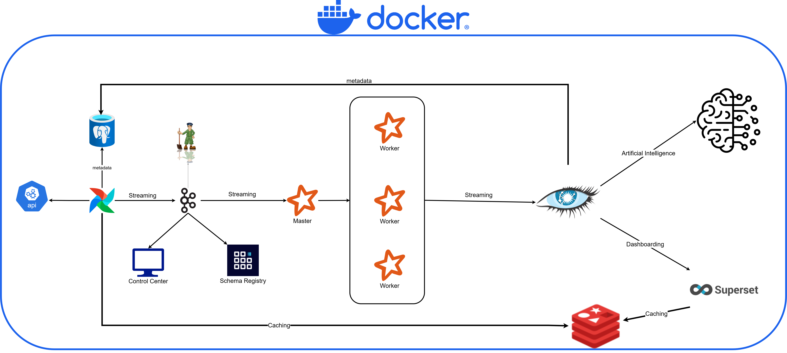

# End-to-End Big Data Pipeline

A complete, production-ready data engineering project demonstrating a modern data pipeline architecture using containerized services.

## 📊 Project Overview

This project implements a comprehensive data pipeline that ingests real-time data, processes it at scale, stores it in multiple databases, and visualizes insights through interactive dashboards.

**Data Flow:**
```
Random User API → Airflow → Kafka → Spark → Cassandra (Data) + PostgreSQL (Metadata) → Superset (Visualization)
```

**Key Insight:** PostgreSQL is used exclusively for metadata (Airflow DAGs, Superset dashboards). Application data flows through Kafka → Spark → Cassandra. Redis provides in-memory caching for performance.

## 🏗️ Architecture

### Components

| Component | Purpose | Technology |
|-----------|---------|-----------|
| **Data Ingestion** | Real-time data streaming | Kafka, Python |
| **Orchestration** | Workflow automation & scheduling | Apache Airflow |
| **Stream Processing** | Real-time data transformation | Apache Spark |
| **Metadata Storage** | Platform metadata (DAGs, dashboards, sessions) | PostgreSQL |
| **Data Storage** | Application data (persistent, distributed) | Apache Cassandra |
| **Caching** | High-speed in-memory cache | Redis |
| **Visualization** | Business Intelligence dashboards | Apache Superset |
| **Containerization** | Environment standardization | Docker & Docker Compose |

### Service Architecture



See [ARCHITECTURE.md](./ARCHITECTURE.md) for detailed component descriptions and deployment information.

## 🚀 Quick Start

### Prerequisites

- Docker & Docker Compose
- Python 3.10+
- Git

### Installation

1. **Clone the repository**
```bash
git clone <repository-url>
cd E2E
```

2. **Start all services**
```bash
docker compose up -d
```

3. **Verify services are running**
```bash
docker compose ps
```

4. **Access the services**
- Airflow UI: http://localhost:8080 (metadata orchestration)
- Superset UI: http://localhost:8088 (dashboarding)
- Kafka: localhost:9092 (message broker)
- Spark Master UI: http://localhost:8080 (processing)
- PostgreSQL: localhost:5432 (metadata only)
- Cassandra: localhost:9042 (application data)
- Redis: localhost:6379 (caching)

### Default Credentials

| Service | Username | Password | Notes |
|---------|----------|----------|-------|
| Airflow | airflow | airflow | Metadata DB (PostgreSQL) |
| Superset | admin | admin | Metadata DB (PostgreSQL) + Cache (Redis) |
| PostgreSQL | airflow / superset | airflow / superset | Metadata only (not OLTP) |
| Cassandra | — | — | Application data storage |
| Redis | — | — | In-memory cache (no auth by default) |

## 📁 Project Structure

```
E2E/
├── airflow/                      # Airflow orchestration
│   ├── dags/
│   │   └── kafka_stream.py      # Main streaming DAG
│   ├── docker-compose.yml        # Airflow services
│   ├── Dockerfile               # Custom Airflow image
│   ├── requirements.txt          # Python dependencies
│   └── config/
│       └── airflow.cfg          # Airflow configuration
├── kafka/                        # Kafka setup
│   └── docker-compose.yml        # Kafka & Zookeeper services
├── spark/                        # Spark processing
│   └── docker-compose.yml        # Spark services
├── postgres/                     # PostgreSQL database
│   ├── docker-compose.yml
│   ├── airflow_init.sql         # Airflow DB initialization
│   └── superset_init.sql        # Superset DB initialization
├── cassandra/                    # Cassandra NoSQL database
│   └── docker-compose.yml
├── superset/                     # Superset BI platform
│   ├── docker-compose.yml
│   └── docker/
│       ├── superset_config.py    # Superset configuration
│       ├── docker-bootstrap.sh   # Bootstrap script
│       └── .env                  # Environment variables
├── docker-compose.yml            # Root compose (includes all services)
└── scripts/                      # Utility scripts
    └── entrypoint.sh            # Service initialization
```

## 🔄 Data Pipeline Details

### 1. Data Ingestion (Kafka Stream)
The DAG in [airflow/dags/kafka_stream.py](airflow/dags/kafka_stream.py) performs:
- Fetches random user data from RandomUser.me API
- Formats and structures the data
- Produces messages to Kafka topic `users_created`
- Scheduled to run periodically

**Topics:**
- `users_created` - Raw user data stream from API

### 2. Stream Processing (Spark)
Spark Structured Streaming jobs consume from Kafka and:
- Read from `users_created` Kafka topic
- Apply transformations and data quality checks
- Enrich data with additional attributes
- Write processed data to Cassandra (primary storage)

### 3. Metadata & Caching Layer
**PostgreSQL** (Metadata Only):
- Airflow DAG definitions and task state
- Superset dashboard/slice definitions and user sessions
- DO NOT use for application data

**Redis** (In-Memory Cache):
- Caches Airflow task state and DAG metadata
- Caches Superset query results for fast dashboard loads
- Stores session information for both Airflow and Superset

### 4. Data Storage (Cassandra)
**Cassandra** (NoSQL - Primary Storage):
- User profiles and events
- Time-series data from Spark processing
- High write-throughput, distributed architecture
- Replicated across cluster for durability

### 5. Data Visualization (Superset)
Interactive dashboards displaying:
- User demographics (from Cassandra)
- Activity patterns and trends
- Real-time metrics and KPIs
- Metadata and dashboard state (from PostgreSQL)
- Cached query results (from Redis)

## 🛠️ Configuration

### Environment Variables

Key environment files:
- [postgres/.env](postgres/.env) - PostgreSQL configuration
- [superset/docker/.env](superset/docker/.env) - Superset configuration

**Modify these to customize:**
- Database credentials
- Service ports
- Log levels
- Performance tuning parameters

### Airflow Configuration
Edit [airflow/config/airflow.cfg](airflow/config/airflow.cfg) for:
- Parallelism settings
- Executor configuration
- DAG parsing behavior

## 📊 Database Schemas

### PostgreSQL - User Profile Table
```sql
CREATE TABLE users (
    user_id SERIAL PRIMARY KEY,
    first_name VARCHAR(255),
    last_name VARCHAR(255),
    email VARCHAR(255) UNIQUE,
    phone VARCHAR(20),
    nationality VARCHAR(5),
    created_at TIMESTAMP DEFAULT CURRENT_TIMESTAMP
);
```

### Cassandra - User Events Table
```cql
CREATE TABLE user_events (
    event_id UUID PRIMARY KEY,
    user_id INT,
    event_type TEXT,
    event_data MAP<TEXT, TEXT>,
    timestamp BIGINT,
    created_at TIMESTAMP
);
```

## 🔍 Monitoring & Debugging

### View Logs
```bash
# Airflow logs
docker logs airflow-scheduler

# Spark logs
docker logs spark-master

# Kafka logs
docker logs broker

# PostgreSQL logs
docker logs postgres
```

### Health Checks
```bash
# Check all services
docker compose ps

# Check Kafka broker
docker exec broker kafka-broker-api-versions.sh --bootstrap-server localhost:9092

# Check PostgreSQL connection
psql -h localhost -U airflow -d airflow
```

### Common Issues

**Database Connection Error**
```bash
# Verify network connectivity
docker network inspect e2e_airflow-network

# Restart database
docker compose -f postgres/docker-compose.yml restart
```

**Kafka Producer Issues**
```bash
# Check Kafka broker status
docker logs broker | grep ERROR

# Verify topic exists
docker exec broker kafka-topics.sh --list --bootstrap-server localhost:9092
```

## 🚢 Deployment

### Production Considerations

1. **Security**
   - Use environment-specific .env files
   - Enable SSL/TLS for database connections
   - Implement authentication for all services

2. **Scaling**
   - Increase Spark executor count
   - Configure Cassandra replication factor
   - Set up Kafka partitioning strategy

3. **Monitoring**
   - Implement centralized logging (ELK stack)
   - Add metrics collection (Prometheus)
   - Set up alerting mechanisms

4. **Backup & Recovery**
   - PostgreSQL backup strategy
   - Cassandra snapshot management
   - Kafka topic retention policies

## 📚 Key Technologies

- **Apache Airflow** - Workflow orchestration (metadata in PostgreSQL)
- **Apache Kafka** - Event streaming platform
- **Apache Spark** - Distributed data processing
- **PostgreSQL** - Relational database (metadata only, NOT for OLTP)
- **Apache Cassandra** - NoSQL database (primary application data storage)
- **Redis** - In-memory cache (session & query result caching)
- **Apache Superset** - Data visualization & BI
- **Docker & Docker Compose** - Containerization

## 🤝 Contributing

1. Create a feature branch (`git checkout -b feature/improvement`)
2. Make your changes
3. Commit with descriptive messages
4. Push to the branch
5. Open a Pull Request

## 📝 License

This project is open source and available under the MIT License.

## 📧 Support

For issues, questions, or suggestions:
- Open an issue on GitHub
- Create a discussion for feature requests

---

**Built with ❤️ for learning and production-ready data engineering**
